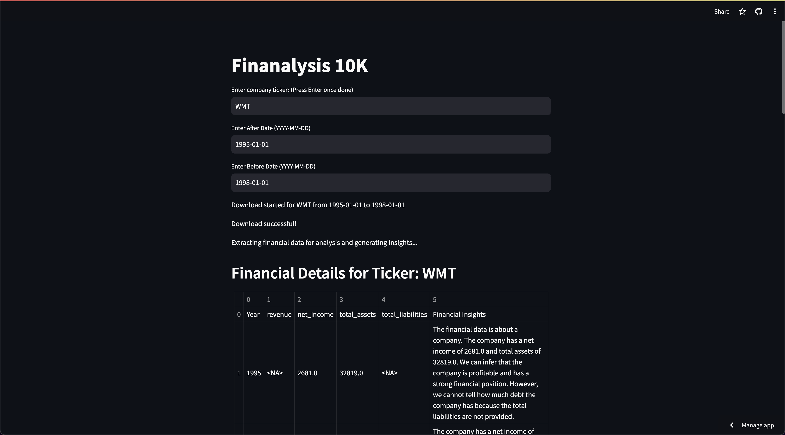

# Finanalysis 10K!
Embark on an exhilarating journey through the labyrinth of financial data with our dynamic web application, Finanalysis 10K! Unveil the secrets hidden within the SEC filings of publicly traded companies and gain deep insights into their financial performance over time.

## Tech Stack

Marvel at the technologies powering our platform:

- **Python**: The magician behind the scenes, weaving its magic with powerful libraries and a vibrant community.
  
- **Streamlit**: Our canvas for creating interactive web experiences with unparalleled ease and speed.

- **Google Generative AI (Gemini API)**: The oracle guiding us through the labyrinth of financial data, providing invaluable insights.

- **sec_edgar_downloader**: Your key to unlocking the treasure trove of SEC filings.

- **BeautifulSoup**: The master of HTML parsing, extracting pearls of wisdom from the vast sea of financial documents.

- **Matplotlib**: Our wand for crafting enchanting visualizations that bring numbers to life.

- **Tabulate**: The maestro conducting the symphony of structured data, elegantly arranged for your perusal.

## How to Run

1. **Clone the Repository:**
   ```bash
   git clone https://github.com/Vasu1712/FSILassignment.git
   cd FSILassignment
2. **Install Dependencies:**
   ```bash
   pip install -r requirements.txt
3. **Run the Streamlit App:**
   ```bash
   streamlit run app.py
4. **Access the Streamlit Dashboard:**
   Open a web browser and navigate to http://localhost:8501 to interact with the financial data analysis dashboard.

## Demo

Explore the live demo of the app [here](https://company-10k-analyzer.streamlit.app/).


*Screenshot: Download Successful and Generating Insights for WMT from 1995 to 1998.*


*Screenshot: Intersting Observations*


*Screenshot: Overall Insights and Analysis of WMT.*


## Features

Join us on this exhilarating journey where you can:

- **Summon the Filings**: Enter the ticker symbol and choose your date range to summon the mystical 10-K filings from the depths of the SEC archives.

- **Unearth Insider Trading**: Peer into the activities of insiders, gaining insights into their transactions and potential implications for the company.

- **Explore Profitability Metrics**: Delve into the intricacies of profitability with metrics like Gross Profit Margin, Operating Profit Margin, and Net Profit Margin, shedding light on the company's operational efficiency and financial health.

- **Interact and Explore**: Engage with the data, ask questions, and receive illuminating answers that guide your path to financial enlightenment.

- **Visualize the Odyssey**: Behold the majestic line plots that chart the course of revenue growth, profitability, and financial stability over time.

- **Glimpses of Growth**: Witness the rise and fall of revenue, a testament to a company's journey through the tides of the market.

- **The Dance of Profitability**: Follow the ebb and flow of profitability metrics, a mesmerizing spectacle revealing the pulse of operational efficiency.

- **Insider Insights**: Peek behind the curtain of insider trading, deciphering the actions of those within the company and their potential impact.

## Why Should a user care about the insights?

These insights are more than just numbers on a screen; they are the compass guiding investors, analysts, and stakeholders through the turbulent seas of finance:

- **Illuminate the Path**: Revenue growth lights the way, showing the promise of future prosperity.

- **Navigate the Rapids**: Profitability metrics are the rapids of financial performance, where skillful navigation ensures safe passage.

- **Decode Insider Actions**: Insider trading activities provide clues about the confidence and outlook of those intimately connected with the company.


## Feedback and Beyond

Have thoughts to share or encounters to recount? Venture forth and let us know your tales [here](https://github.com/Vasu1712/FSILassignment/issues).